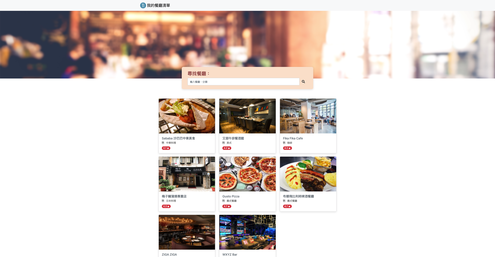

# 我的餐廳清單

### 使用者畫面

使用 Node.js + Express 打造的餐廳美食清單網站

## 基本功能
1.使用者可以查看餐廳照片、餐廳名稱、餐廳分類、餐廳評分

2.使用者可以再點進去看餐廳的詳細資訊：
類別、地址、電話、描述、圖片

3.使用者可以透過搜尋餐廳名稱來找到特定的餐廳

4.使用者可以透過搜尋餐廳類別來找到特定的餐廳

## 環境設置
1.安裝 node.js 與 npm

2.將專案 clone 到本地
```
https://github.com/hl94vul3h6/Restaurant_list.git
```
3. 安裝 npm 套件

```
npm install
```
4. 執行程式

```
npm run start
```
5.若出現此行網址代表運行順利
```
Express is running on http://localhost:3000
```

## 開發工具
* Node.js v14.18.2
* Express ^4.17.2
* Express-Handlebars ^3.0.0
* Bootstrap 4.3.1
* Font-awesome 5.8.1